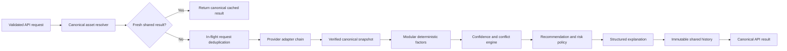

# Financial intelligence architecture

Status: Phase 6.1 initial production implementation  
Engine version: `6.1.0`  
Weighting version: `asset-horizon-weights-v1`  
Recommendation rules: `recommendation-policy-v1`

## Purpose and boundaries

The intelligence domain produces explainable market analysis from verified data that The SFM can actually retrieve. It does not place trades, estimate returns, generate unsupported price targets, or require an LLM. The result is provider-independent and is suitable for later use by watchlists, alerts, reports, the trader terminal, and mobile clients.

Phase 6.1 integrates the result into Smart Market Analysis only. Existing routes and engines remain available to their current consumers while later phases migrate them deliberately.

## Audit findings

The pre-implementation audit identified four overlapping deterministic paths:

- `src/lib/market/marketAgent.ts`
- `src/lib/market/signalEngine.ts`
- `src/lib/trader/analysisEngine.ts`
- `src/lib/trader/recommendationEngine.ts`

They used different recommendation vocabularies, weights, confidence calculations, and price-level policies. Smart Market Analysis also calculated a UI-only confidence value from fixed bonuses, including a bonus when an AI summary was ready. The previous signal panel fetched a second recommendation from `/api/market/signals`. These two page-level outputs have been replaced by the canonical intelligence result, without deleting the legacy APIs or their other consumers.

Reusable infrastructure already present and retained:

- canonical market-symbol resolution;
- normalized quote, candle, profile, and fundamental data;
- market provider fallback, health, timeout, and stale metadata;
- watchlist, alert, news, Sharia research, and provider-health schemas;
- Phase 5.0D `observability_events` infrastructure;
- authentication helpers and the existing shared rate limiter.

The audit also found that no existing table could reproduce a complete versioned intelligence result. A new append-only history table was therefore justified instead of overloading trade, signal, or watchlist tables.

## Domain layout

| Layer | Location | Responsibility |
| --- | --- | --- |
| Canonical contracts | `src/domain/intelligence` | Requests, results, factors, provenance, enums, and validation |
| Deterministic methods | `src/lib/intelligence` | Weights, factors, freshness, confidence, policy, and structured explanation |
| Provider adapter | `src/providers/intelligence` | Converts the existing verified market pipeline to a canonical snapshot |
| Orchestration | `src/services/intelligence` | Resolution, cache, deduplication, provider fallback, persistence, and telemetry |
| API | `src/app/api/intelligence` | Validated, rate-limited POST and read endpoints |
| UI | `src/components/intelligence` | Localized evidence ledger with progressive disclosure |
| Persistence | `public.intelligence_analyses` | Immutable result and audit snapshot |

## Execution flow

If every provider fails and no prior shared analysis exists, the same pipeline creates unavailable factors, confidence no higher than the insufficient-evidence cap, and `INSUFFICIENT_DATA`. If refresh fails but a previous shared analysis exists, its factors are explicitly marked stale, confidence is recalculated with stale penalties, and the response contains critical stale-refresh warnings.

## Canonical result invariants

- Recommendation is one of `BUY`, `SELL`, `WAIT`, or `INSUFFICIENT_DATA`.
- Confidence is an integer from `0` to `100` produced only by the deterministic engine.
- Confidence is labeled analysis confidence, never probability of profit.
- `dataAsOf`, freshness state, warnings, factor availability, provider attempts, and versions are explicit.
- Targets, entry prices, and stop-losses are empty/unavailable until a documented calculation method is implemented.
- Sharia status is unavailable unless status, source, and review date are all present.
- The client never receives provider secrets, raw provider payloads, or confidential prompts.
- Explanations are structured keys and factor references; localization occurs in the UI.

## Cache and concurrency model

The orchestrator uses a canonical key containing asset type, canonical symbol, horizon, requested modules, and weighting version. It checks:

1. a process-local fresh result cache;
2. the latest fresh shared persisted result;
3. a process-local in-flight promise map.

This prevents duplicate provider work inside an application instance and reuses persisted results across instances. All Phase 6.1 analyze/latest reads are deliberately shared-only. A private history row can never enter a shared cache or become a shared previous-analysis reference.

Distributed locking and distributed rate limiting are deferred. The existing market provider cache reduces cross-instance duplication, but a later phase should add a shared coordination primitive before materially increasing request volume.

## Access and data ownership

Smart Market Analysis remains available to the existing guest surface. Access policy is:

- anonymous analysis: 8 requests/minute per best-effort client IP;
- authenticated analysis: 30 requests/minute per user;
- authenticated force refresh: 6 requests/minute per user;
- anonymous force refresh: denied;
- latest shared result: 60/minute anonymous and 120/minute authenticated.

No new premium entitlement is invented in Phase 6.1 because the existing surface is guest-accessible and the repository has no established intelligence-specific tier. A future entitlement adapter can be added at the API boundary.

Database scope is intentional:

- `shared` rows contain public market analysis and have `user_id = null`;
- `private` rows require a user ID and are readable only by that user;
- anonymous users have no direct table grant and use the server endpoint;
- authenticated clients have read-only table grants, constrained by RLS;
- only the server service role writes history.

The Phase 6.1 endpoints return shared results only. Private persistence is an interface for a future explicitly scoped endpoint.

## Compatibility decisions

- `/api/market/analyze` remains the verified data acquisition path behind the provider adapter.
- `/api/market/signals`, market-agent routes, trader analysis, and saved signal history are not deleted.
- The optional `/api/market/ai-insight` summary remains a presentation aid on the page, but does not affect canonical confidence, risk, or recommendation.
- Existing watchlists, alerts, reports, and terminal consumers are unchanged.

This adapter-first approach avoids a risky platform-wide rewrite and gives later phases a canonical migration target.

## Extension points

New factor modules implement `IntelligenceFactorModule`. New providers implement `IntelligenceProvider`. Neither may alter confidence directly. A future LLM summary may consume only the canonical result and must be validated against its structured facts before display.

Any methodology change requires new version constants, new tests, and immutable new result rows. Historical rows are never rewritten.
