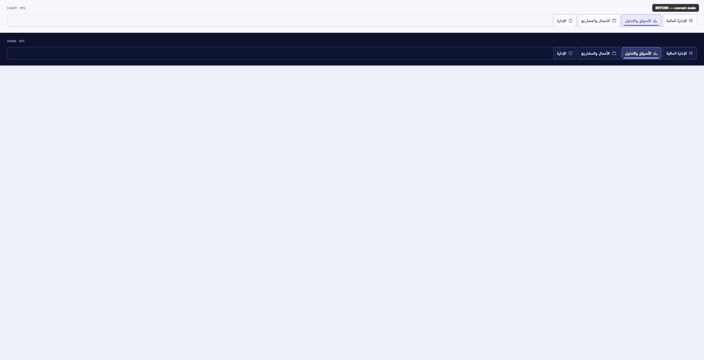
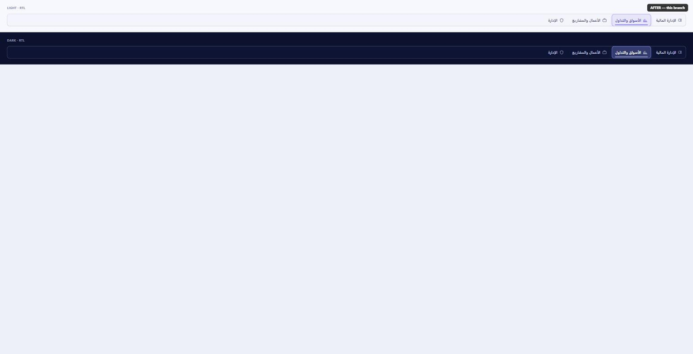

# Premium interaction-system pass (2026)

Design-only pass on THE SFM's button/tab/segmented-control language. No
business logic, routes, or copy changed — CSS custom-property values and a
handful of local `<style jsx>` rule bodies only.

## Benchmark: global workspace switcher

The four top-nav workspace controls (الإدارة المالية / الأسواق والتداول /
الأعمال والمشاريع / الإدارة) were the explicit reference complaint: every
tab carried its own visible border, background fill, and inset shadow
(`--workspace-switcher-item-bg/border/shadow`), so the group read as four
separate outlined buttons rather than one segmented control.

**Before** (current `main`) vs **after** (this branch), light + dark,
Arabic RTL — rendered from the real token/component CSS, no mockups:

Changes, all in `src/styles/themes.css` + `src/components/WorkspaceSwitcher.tsx`:

- Inactive items: `item-bg`/`item-border` → `transparent`, `shadow` → `none`,
  icon colour `--sidebar-icon` (always primary-tinted) → `--foreground-muted`.
  Only the active pill now carries a fill, border, and shadow.
- Active fill/border stay on the existing **Variant 03** translucent
  `color-mix(in srgb, var(--primary) …)` contract (locked in by
  `globalHeaderVariant03.test.ts`) — nudged slightly stronger to compensate
  for the removed per-item borders. No solid gradient block was reintroduced.
- Fixed a CSS-specificity gap where hovering the *active* tab fell back to
  the generic hover background/border/icon tokens instead of keeping its
  selected look (new `--workspace-switcher-item-active-hover` token +
  explicit `[data-active='true']:hover` overrides).
- Bottom active indicator slimmed 3px → 2px and softened slightly.

Locked in by `workspaceSwitcherAffordance.test.ts` (pre-existing),
`globalHeaderVariant03.test.ts` (pre-existing), and the new
`workspaceSwitcherPremiumSegmentedControl.test.ts`.

## Site-wide audit

Grepped for button/tab/chip/segmented/pagination patterns across `src`
(~80 files touch this surface area in some form). The dominant
anti-pattern, beyond the workspace switcher itself, was **tab/toggle strips
whose active state is a fully solid `background: var(--primary)` block**
with `color: var(--primary-foreground)` — the same "just filled blue" style
flagged in the reference screenshot, duplicated ad hoc per page instead of
using the shared `.sfm-chip`/`.sfm-nav-link` soft-fill + tinted-border
pattern that already exists in `globals.css`.

Found 9 occurrences of that exact pattern across 7 files via
`grep -rn '\.active{background:\s*var(--primary)'`.

### Migrated in this PR

| Surface | File | Priority tier |
|---|---|---|
| Global workspace navigation (benchmark) | `WorkspaceSwitcher.tsx`, `themes.css` | 1 |
| Business-hub employee view toggle | `app/employees/page.tsx` | 3 |
| Project financial-model view/scenario toggles | `projects/ProjectFinancialModelTab.tsx` | 3 |
| Admin: company tabs | `sfm-admin-control/companies/CompanyAdminClient.tsx` | 12 |
| Admin: Instagram automation tabs | `sfm-admin-control/instagram-automation/InstagramAutomationClient.tsx` | 12 |
| Defensive-stocks category tabs | `defensive-stocks/DefensiveStocksNewsPage.tsx` | — |
| Tech News category filter chips + advanced-filters trigger/clear button | `tech-news/TechNewsLayoutStyles.tsx` | 8 |
| Monthly-subscriptions examples tabs | `expenses/monthly-subscriptions/page.tsx` | 9 |

All of the above: CSS-value-only changes (background/border/color/shadow),
no class renames, no markup changes, no behavior changes.

### Intentionally deferred (not touched in this PR)

- **`setup/page.tsx` `.choice-btn`/`.toggle-card`/`.focus-card`** — these are
  selection *cards* (bigger option blocks, e.g. picking a plan/category),
  not slim nav tabs. A solid, bold fill for the chosen card is a
  legitimate, still-premium pattern for that semantic purpose (per the
  instruction to preserve hierarchy/semantic purpose, not flatten every
  control to one visual language), so left as-is.
- **The remaining ~65 files** matched by the broader chip/tab/pagination
  grep (growth/cyclical/banking/energy/shariah/dividend news pages, invest
  center rows, market-analysis panels, AI-analyst surfaces, table
  toolbars/pagination, dialog actions). These already consume semantic
  tokens (no raw hex/shadow literals — confirmed by `check:visual-system`,
  which passes with zero findings) and did not show the specific
  solid-block or every-item-bordered anti-patterns; a full one-by-one
  visual audit of all of them is a larger follow-up than this PR's stated
  benchmark-first, high-traffic-next scope. Flagging here so it isn't
  mistaken for "done."

## Validation

Run locally on this branch (Windows, pnpm):

- `pnpm install --frozen-lockfile` — OK
- `pnpm lint` — pass, no new errors/warning-debt
- `pnpm typecheck` — pass
- `pnpm check:i18n` — pass (ar/en/fr complete)
- `pnpm check:visual-system` — pass, zero raw-colour/shadow/radius/legacy-alias findings
- `pnpm check:maintainability` — guard passed (pre-existing oversized-file warnings unchanged)
- `pnpm check:repo-hygiene` — pass
- `pnpm test:run` — **249 files / 2055 tests passed**, including the two
  pre-existing workspace-switcher contract tests and the new one
- `pnpm build` — succeeds
- `pnpm check:performance-budget` — all 15 budget rows PASS (post-build)

**Not run locally:** `pnpm test:smoke` (Playwright). The auth-setup project
requires real `E2E_USER_EMAIL`/`E2E_USER_PASSWORD` (and admin equivalents)
against a live Supabase project; those secrets aren't available in this
environment. This repo's CI workflow has them configured, so CI on this PR
is the source of truth for RTL/LTR × light/dark × desktop/mobile e2e
coverage — please check the CI run before merging.
